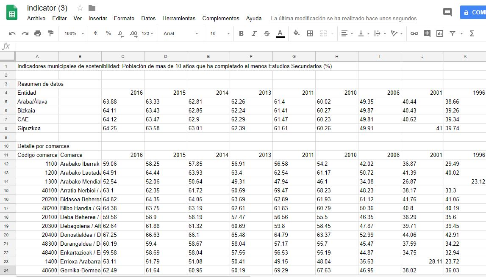

# Ejemplo 4 CSV

- Con los dos métodos anteriores se consigue visualizar datos de CSV en una hoja de cálculo en Drive; sin embargo, algunos caracteres no se ven adecuadamente. Para resolver este problema hay otro método.
- Descargarse el archivo indicator.csv
- Abrir Notepad ++
- Abrir el archivo CSV descargado: File, open-> seleccionar indicator.csv
- Una vez abierto, guardarlo como indicator.txt: file, save as-> seleccionar el tipo TXT
- Cambiar comas por puntos como se ha explicado anteriormente
- Cambiar punto-coma por comas de la misma forma que el paso previo
- Subir el archivo indicator.txt a Drive
- Abrir una hoja de cálculo en Drive
- Importar el documento TXT a la hoja de cálculo: archivo-> importar-> seleccionar indicator.txt
- Se abrirá un cuadro adicional donde se han de rellenar los siguientes campos

- Hacer click encima de abrir ahora y comprobar que los caracteres se visualizan correctamente como en la imagen

